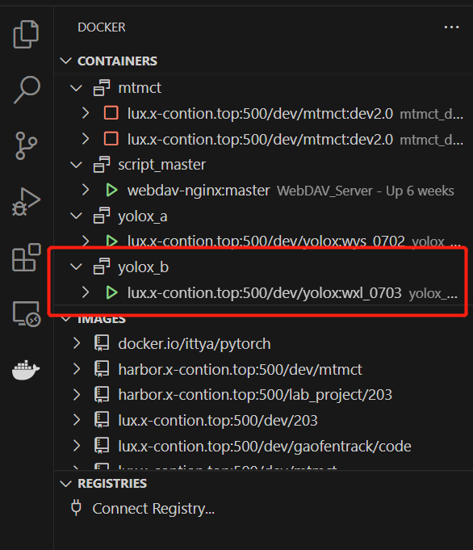

# Docker Compose

## 编排参数

+ 所谓编排参数，即`docker-compose.yaml`文件中涉及的参数。
+ 掌握编排参数的基本语法后，才可以自行编写或仿写`docker-compose.yaml`文件以管理容器。

### 总览框架及自写思路

+ 总体框架

```yaml
version:"3.9"
services:
 service_name1:
  参数:值
  XXXXX:YYYY
  XXXXX:YYYY
  XXXXX:YYYY
 service_name2:
  XXXXX:YYYY
  XXXXX:YYYY
  XXXXX:YYYY
```
  + 总体框架说明

    + docker compose的语法是`yaml`，其以`空格`为缩进的单位，以`冒号:`表示从属关系。
    + `docker-compose.yaml`的第一行   `version`是规定docker compose的语法版本，一般用3.9
    + `docker-compose.yaml`的第二行   `services`要括住此`docker-compose.yaml`管理的所有容器
    + `docker-compose.yaml`的后续，以`service_name`为单位形成代码块，一个`service_name`对应一个容器。
    + 在每一个`service_name`内，需要书写和对应容器相关的`参数:值`。

### 自写思路

+ 自写`docker-compose.yaml`的基本思路是仿写/复制粘贴，即先从写好的`docker-compose.yaml`文件中将基本框架/全部内容战体过来，再在内部修改具体参数。
+ 自写`docker-compose.yaml`的第二步思路是`对比改写`，即对比原容器与当前新创建容器的不同，改写对应参数的值。例如`image`由于使用镜像不同就可能要改写。
+ 自写`docker-compose.yaml`的第三步是`增删参数`，这一点需要在基本熟知或已经查到要增删的参数名称和含义的前提下，且十分明确此参数对应构建容器作用的前提下，执行增删指令。

### 常用编排参数

+ 说明

  + 编排参数比较多，全部整理入笔记是十分不合理不科学的事情。记忆常见的编排参数及其用法，且能查询到想用的编排参数及其用法就可以了。

+ 基本模板

  + ```yaml
    demo:
     image: lux.x-contion.top:500/x-contion/cuda_conda_pytorch:cu118-py39-torch13
     entrypoint: "/usr/sbin/sshd -D"
     privileged: true
     container_name: yolox_B
     environment:
      - DEBUG=1
      - SHOW='true'
      - DOCKER_BUILDKIT=1
      - NVIDIA_DRIVER_CAPABILITIES=compute,video,utility,graphics
     volumes:
      - ./:/workspace
      - /data:/data:ro
      - /output:/output
     deploy:
      mode: replicated
      resources:
       reservations:
        devices:
         - driver: nvidia
          capabilities: [gpu]
          count: all
        memory: 16g
     shm_size: 2
    ```

  

+ **image**

  + ```yaml
    image: REPOSITORY(仓库名称):TAG(标签名称)
    ```

  + `REPOSITORY(仓库名称):TAG(标签名称)`是`image(镜像)`常见的索引方式，其具体含义见 [Docker基础知识.md](Docker基础知识.md) 。

  + 参数image后面要写上，使用的镜像的仓库名称和标签名称用于索引镜像。


+ **entrypoint**

  + ```yaml
    entrypoint: "/usr/sbin/sshd -D"
    ```

  + 当容器启动时，Docker会将`entrypoint`参数指定的命令作为容器的入口点执行。
  + `/usr/sbin/sshd` 是 OpenSSH 服务器的可执行文件路径，它用于启动 SSH 服务。
  + `-D` 是 OpenSSH 的选项，它告诉 SSH 服务器在前台运行并输出日志，而不是以守护进程模式运行。
  + 由于一般是通过vscode的ssh访问服务器上的docker，所以要启动ssh服务且在前台运行。


+ **privileged**

  + ```shell
    privileged: true
    ```

  + 用于指定容器是否具有特权模式（Privileged Mode）。将容器设置为特权模式意味着它在安全限制方面具有更高的权限，可以执行一些需要特权级别访问的操作。


+ **container_name**

  + ```shell
    container_name: yolox_B
    ```

  + 用于指定容器的名称，这个名称是自己取的，每个容器都应该有一个独一无二的名称。可以在vscode的docker扩展里看到这个名称，如下。

  + 


+ **environment**

  + ```shell
    environment:
      - DEBUG=1
      - SHOW='true'
      - DOCKER_BUILDKIT=1
      - NVIDIA_DRIVER_CAPABILITIES=compute,video,utility,graphics
    ```

  + 用于指定container内的环境变量。目前无法理解这四个变量分别用于指定什么环境变量。以及在容器中进一步有什么作用，照抄模板总没错。学习直觉是以后遇到了这方面的问题再去查如何解决。
  + 遗留一个问题，例如CUDA_VISABLE_DEVICES这样的环境变脸是否是在这里设置。


+ **volumes**

  + ```shell
    volumes:
          - ./:/workspace 
          - /data/Datasets:/data/Datasets:ro 
          - /data/Weights:/data/Weights:ro
          - /data/Output:/data/Output
    ```

  + 这里的`volumes`参数涉及容器和宿主机之间的路径映射问题。

  + `- ./:/workspace`是将`docker-compose.yaml`的上一级目录设置为容器的`/workspace`。

  + `- /data/Datasets:/data/Datasets:ro`是做数据集的映射，数据集映射到与`/workspace`同级的目录是为了避免git时检查出成千上万张照片修改的问题。`ro`代表`readonly`，数据集是只读的。数据集可以通过软连接的方式，连接到项目需要的路径。

  + `- /data/Weights:/data/Weights:ro`是训练模型的权重的映射，含义同上。

  + `- /data/Output:/data/Output`是模型输出的映射，含义同上。

  

+ **deploy**

  + ```shell
    deploy:
          mode: replicated
          resources:
            reservations:
              devices:
                - driver: nvidia
                  capabilities: [ gpu ]
                  count: all
              memory: 16g
    ```

    

  

+ build

  + 和dockerfile配合使用的，写到dockerfile时进一步写。

