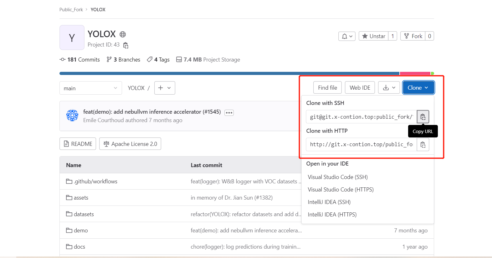
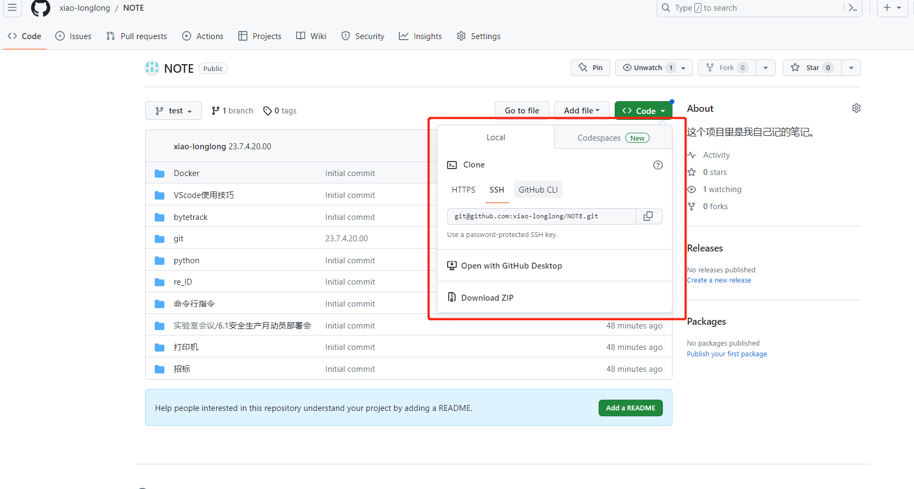

# git到remote

+ 这篇文章旨在记录如何将代码git到远程。
  + 远程包括实验室的github和自己的gitlab。
  + 操作方法包括命令行和git graph两种

## 1.1本地安装git

```shell
# 一般来说只有在新的docker容器或宿主机的新账户上才没有git，即此处的指令并非是必要的。

# 安装git
apt-get update
apt-get install git

# 配置git
# user_name和mail建议用github的。
git config --global user.name "user_name"
git config --global user.email "mail"

# 查看配置，确认成功
git config --global --list
```

## 1.2本地项目配置git

```shell
# 对于每个项目都要配置git才能使用，方法如下

# 初始化新项目的 Git 仓库
git init

# 将项目文件添加到 Git 仓库中
git add .

# 提交项目的初始版本
git commit -m "Initial commit"
```

## 2.1命令行操作

### 2.1.1git到实验室的gitlab

```shell
# 为项目新建分支并切换到此分支（此步骤不必要，如果想直接上传主分支，就不用新建分支）
git branch <新分支名>

# 添加实验室gitlab为远程仓库
git remote add <远程仓库名> <gitlab_URL>

# 推到实验室的gitlab上
git push <远程仓库名> <分支名>
```
+ 说明
  + <gitlab_URL>需要通过如下网址登陆是实验室的gitlab，或新建项目，或找到要psuh的项目以拿到,使用HPPT即可,如下。
> http://git.x-contion.top:1213/


## 2.1.2git到自己的github

```shell
# 为项目新建分支并切换到此分支（此步骤不必要，如果想直接上传主分支，就不用新建分支）
git branch <新分支名>

# 添加自己的github为远程仓库
git remote add <远程仓库名> <github_URL>

#########################################################
#在推到自己的github上之前，需要把项目所在电脑的公钥，放到github上
#########################################################

# 推到自己的github上
git push <远程仓库名> <分支名>
```

+ 说明
  + <github_URL>是在自己的github的对应项目的ssh处下拿到的，如下图，github的服务器在国外，走HTTP会超时报错。

