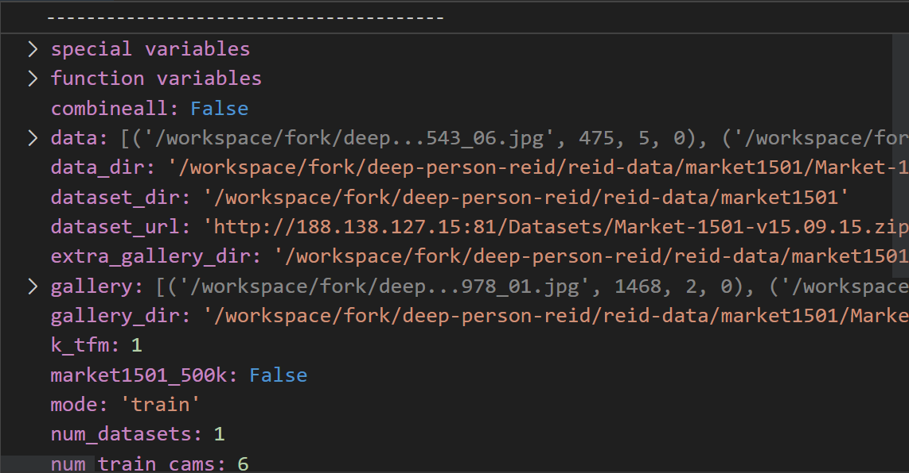
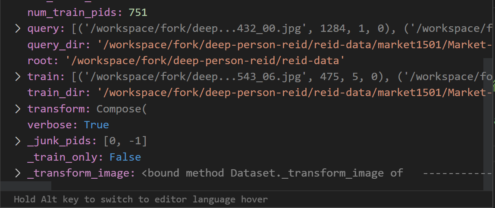

# ImageDataManager学习

## 代码内容向知识

+ **ImageDataManager的核心**
  + ==**ImageDataManager的核心是生成trainset**==，其是一个大的类，类中包含了数据集的各种各样的信息

  + 主要信息一览
  
    + 
  
    + 
    + 其中gallery 、query、train是只要处理并生成的信息

---


+ **init_image_dataset函数**

  + trainset_数据集均由init_image_dataset(name,**kwargs)函数计算生成
  + init_image_dataset的==**计算核心是在其返回值__image_datasets[name] (**kwargs)的计算**==，对应如下代码
  + ```python
    return __image_datasets[name](**kwargs)
    ```

    + 说明，这里返回的是一个类，类在一个list列表中引用，且有具体的定义，代码如下；

    + ```python
      # 类在列表中引用的代码
      __image_datasets = {
          'market1501': Market1501,
          'cuhk03': CUHK03,
          'dukemtmcreid': DukeMTMCreID,
          'msmt17': MSMT17,
          'viper': VIPeR,
          'grid': GRID,
          'cuhk01': CUHK01,
          'ilids': iLIDS,
          'sensereid': SenseReID,
          'prid': PRID,
          'cuhk02': CUHK02,
          'university1652': University1652,
          'cuhksysu': CUHKSYSU
      }
      
      # 类的定义的部分代码
      class Market1501(ImageDataset):
          def __init__(self, root='', market1501_500k=False, **kwargs):
              self.root = osp.abspath(osp.expanduser(root))
              self.dataset_dir = osp.join(self.root, self.dataset_dir)
              self.download_dataset(self.dataset_dir, self.dataset_url)
              """
              后续省略
              """
      ```

---


+ **class Market1501(ImageDataset)**类
  + ==**Market1501类的核心是计算self.process_dir**==
  + 在Maeket1501类中，会用self.process_dir方法计算train、query、gallery数据集


---


+ **def process_dir(self, dir_path, relabel=False)函数**

  + ==**process_dir的核心是从root、sources和targets路径中提取出train、gallery和query     (图片的路径,pid,camid,0)**==

    + 其中图片的路径是通过绝对路径方法拼接生成，代码如下

      ```python
      self.root = osp.abspath(osp.expanduser(root))
      self.dataset_dir = osp.join(self.root, self.dataset_dir)
      self.download_dataset(self.dataset_dir, self.dataset_url)
      self.data_dir = self.dataset_dir
      data_dir = osp.join(self.data_dir, 'Market-1501-v15.09.15')
      self.train_dir = osp.join(self.data_dir, 'bounding_box_train')
      self.query_dir = osp.join(self.data_dir, 'query')
      self.gallery_dir = osp.join(self.data_dir, 'bounding_box_test')
      self.extra_gallery_dir = osp.join(self.data_dir, 'images')       
      ```
      
      + 其中(图片的路径,pid,camid,0)中的pid和camid是通过正则化方法匹配提取得出，具体代码如下，正则化方法的是一个字符串匹配提取的方法其具体解释见代码注释。
      
      + ```python
        pattern = re.compile(r'([-\d]+)_c(\d)')
        for img_path in img_paths:
            pid, camid = map(int, pattern.search(img_path).groups())
        ```

---


+ **代码学习快速浏览时的理解：**

  + 数据装载其实只做了训练集的装载和测试集的装载两步，其中**训练集**的装载是只装训练集，**测试集**的装载需要装画廊和查询。

  + 画廊和查询是行人重识别中比较浪漫的说法，

    + **画廊**是用于存放海量目标的数据库。

    + **查询**是存放要寻找比对的目标的数据库。

---


## python技巧向知识

### 一：python的构造函数

+ 示例

```python
class classname：
	def __init__(
     	parameter1 = XXX
        parameter2 = XXX
        parameter3 = XXX 
    ):
        # 构造函数/类的实现
```

+ 说明

​	在构造函数的定义时，需要说明self，具体解释在后续。

​	**构造函数是在类的实例化时执行**，相当于一个特殊的方法。


---


###二：python的继承

+ 示例

```python
class classname1(object):
    """
    这里写类的实现
    """
class classname2(classname1):
    """
    这里写类的实现
    """
```

+ 说明

​	如果一个类没有可以继承的父类，则其继承自默认类object，或**省略不写**。

​	**如果类2继承自类1，则直接在类2定义时在括号内写类1**。

---


### 三、继承父类方法和属性

+ 示例

```python
class classname1():
    def __init__(self,parameters):
        print("这里是父类构造函数的实现")
 
    def method1(self,parameters):
        print("这里是父类方法的实现")
        self.parameter = parameters
        
class classname2(classname1):
    def __init__(self,parameters):
        super(classname2,self).__init__(parameters)
        print("这里是子类构造函数的实现")
     
    def method1(self,parameters):
        super(classname2,self).method1(parameters = parameters)
        print("这里是子类方法的实现")
        
        
obj = classname2("wys")
obj.method1("wxl")
print(obj.parameter)

"""
输出如下

obj = classname2("wys")
这里是父类构造函数的实现
这里是子类构造函数的实现

obj.method1("wxl")
这里是父类方法的实现
这里是子类方法的实现

print(obj.parameter)
wxl
"""
```

+ 说明
  + super(CurrentClassName,self)是调用父类的方法（包括构造函数），**其作用继承父类的方法（包括构造函数）和属性，而不用重写相同的部分**。
  + super的两个**固定**的参数分别是**当前类的名称和self**。
  + **super函数写在子类方法和构造函数的定义处**。


---


### 四：关于self的使用

+ 示例
  + 见上一个示例
+ 说明
  + 记住一句话：**self在定义时需要作为第一个参数说明，在调用时不需要说明**。
  + 在python中**方法才有参数**（构造函数可以看作是特殊的方法。）


###五：文档字符串，可以用

```python
class classname()
"""
 这里是对类的简单说明,类似于多行注释。
 文字属于类的__doc__属性,可以被classname.__doc__调用。
 例如用print(classname.__dac__),将把冒号所引内容打印出来。
"""

```

在文档字符串前加r可以把转义字符直接视为原本字符串，而不再具有转义含义，例如

```python
class classname()
r"""
/n
/t
"""
```

其中的/n不再被理解为换行

---


###六：可变关键字

+ 示例

```python
# 函数定义
def init_image_dataset(name, **kwargs):
	"""
	这里是函数实现
	"""

# 函数调用和参数传递
trainset_ = init_image_dataset(
                name,
                transform=self.transform_tr,
                k_tfm=k_tfm,
                mode='train',
                combineall=combineall,
                root=root,
                split_id=split_id,
                cuhk03_labeled=cuhk03_labeled,
                cuhk03_classic_split=cuhk03_classic_split,
                market1501_500k=market1501_500k
            )

# 其中**kwargs是可变关键字，用于将大量传入参数打包成数据字典。
```

+ 说明
  + 可变关键字用于**传递任意数目的参数**，并将其作为**数据字典打包**。


---


###七：glob

+ 示例

```python
glob.glob(pattern)

```

+ 说明

  + 第一个glob是库名，第二个是函数名。
  + pattern是一类文件的模式，具体可为dir_path/*.jpg。
  + 会以列表形式返回所有dir_path路径下，带有.jpg后缀的文件路径。


---


###八：返回类

+ 示例

```python
# 包含类赋值的代码
trainset_ = init_image_dataset(
                name,
                transform=self.transform_tr,
                k_tfm=k_tfm,
                mode='train',
                combineall=combineall,
                root=root,
                split_id=split_id,
                cuhk03_labeled=cuhk03_labeled,
                cuhk03_classic_split=cuhk03_classic_split,
                market1501_500k=market1501_500k
            )


# 包含返回类的代码
def init_image_dataset(name, **kwargs):
    """Initializes an image dataset."""
    avai_datasets = list(__image_datasets.keys())
    if name not in avai_datasets:
        raise ValueError(
            'Invalid dataset name. Received "{}", '
            'but expected to be one of {}'.format(name, avai_datasets)
        )
    return __image_datasets[name](**kwargs)
```

+ 说明
  + 在生成trainset的过程中数据是通过**返回类**的方式传递的，这其实等价于将类进行赋值。
  + 类的复制本质上是浅拷贝，只要修改其中一个类中变量的值，另外一个类中变量的值也会改变，示例代码如下

```python
class MyClass:
    def __init__(self):
        self.value = 0

# 创建类的实例对象并赋值给变量 obj1 和 obj2
obj1 = MyClass()
obj2 = obj1

# 通过 obj1 修改 value 值
obj1.value = 10

# 通过 obj2 访问 value 值
print(obj2.value)  # 输出结果为 10
```

---


