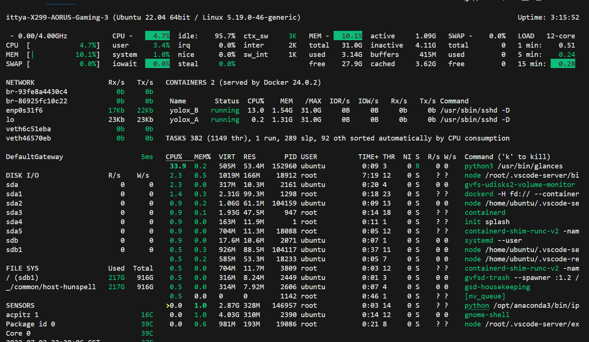

# 命令行小技巧

## 指令

### ipython

+ 指令

  + ```
    ipython
    ```

+ 作用

  + 在命令行启动一个python解释器
  + 可以逐行输入python脚本，并逐行运行结果。

+ 示例

  + ```shell
    (base) root@容器内@f12277a77a5b:/workspace# ipython
    Python 3.9.12 (main, Apr  5 2022, 06:56:58) 
    Type 'copyright', 'credits' or 'license' for more information
    IPython 8.2.0 -- An enhanced Interactive Python. Type '?' for help.
    
    In [1]: import torch
    
    In [2]: torch.__version__
    Out[2]: '1.13.1+cu116'
    ```

+ 退出
  + 在指令中输入`exit`或者`Ctrl+D`可以退出`ipython`。

### glances

+ 说明
  + 在命令行中，`glances` 是一个系统监视工具，用于实时监测和显示系统的各种性能指标。它提供了一个简单而强大的界面，可以显示 CPU 使用率、内存使用情况、磁盘活动、网络流量、进程信息等多种系统资源的实时数据。

+ 示例
  + 
+ 推出
  + `Ctrl+C`